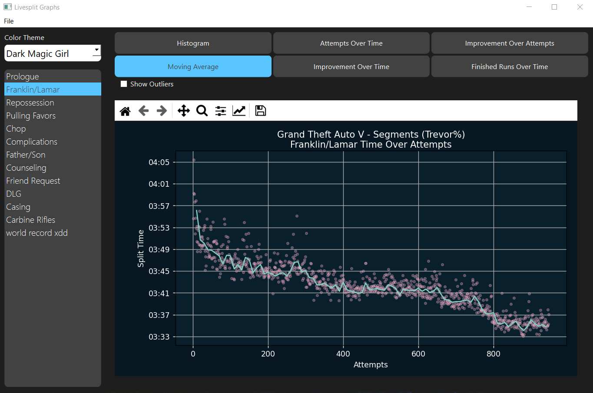

# Livesplit-Graphs

Desktop application to represent Livesplit data in graph format.

Import a Livesplit file and display segment data and full run data. A small variety of graphs and themes are available.
WIP

# Installation

- Download livesplit-graphs.zip from the [latest release](https://github.com/electrorayer/Livesplit-Graphs/releases), and extract
- Find and run livesplit-graphs.exe

or

### *Note: This option might be unstable*
- Install Python
- Download the source zip from the [latest release](https://github.com/electrorayer/Livesplit-Graphs/releases), and extract
- Run requirements.bat to install the necessary dependencies
- Run livesplit-graphs.pyw

